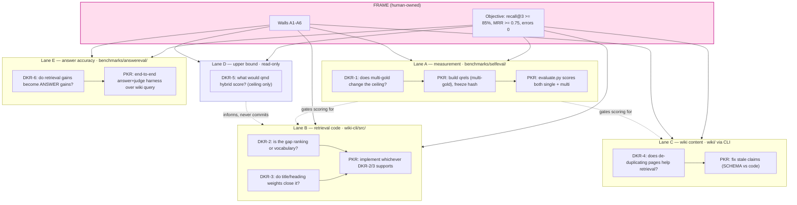

# Fixing the remaining wiki retrieval issues — reverse-tornado frame

Planning mode. No `.okra` store, no workers spawned, no runs started.

## Where we are (measured, not asserted)

`benchmarks/selfeval/evaluate.py` against this repo's own `wiki/`, 44 questions,
one gold page each:

| metric | shipped | now |
| --- | ---: | ---: |
| recall@1 | 0% | 52% |
| recall@3 | 0% | 64% |
| MRR | 0.000 | 0.580 |
| zero-retrieval | 93% | 0% |
| query errors | – | 0 |

120 tests pass. Five root-cause defects fixed (`RESULTS.md`).

## Step 1 — The frame

### Objective

**Maximise answer accuracy: ≥ 85% of the 44 questions answered correctly from
what `wiki query` returns, with recall@3 ≥ 85%, MRR ≥ 0.75, and query errors 0.**

Answer accuracy is the real goal — retrieval is only the means. A page ranked
first is worthless if the caller still cannot answer from it, so the objective is
scored end-to-end: retrieve, answer from the retrieved text alone, judge against
the gold answer. Recall@3 and MRR stay in the frame as the drivers we can move
directly, and because they are LLM-free and therefore cheap to read every round.

Query errors stay in the objective because a crash and a miss looked identical in
three separate places already.

**The tension to decide, not assume:** "maximum accuracy" pulls against wall A1
(stay embeddings-free). Semantic search is probably the largest single accuracy
lever available, and A1 forbids it. That trade-off belongs to the human, so
DKR-5 measures the embeddings ceiling **read-only, committing nothing**, and the
frame is reviewed once there is a number instead of an opinion.

### The trap this frame exists to stop

Switching from single-gold to multi-gold **raises the number without improving
retrieval at all**. Several current "failures" return a page that genuinely
answers the question — the gold label was just arbitrary. So the first task on
the board is the one most able to fake success.

Rule for the whole run: **every report carries both numbers** — the frozen
single-gold score (comparable to today's 64%) and the multi-gold score. A
multi-gold gain with a flat single-gold score is a measurement change, and is
reported as a measurement change, never as progress.

### Anti-goals (walls)

| # | Wall | Metric | Type | Read method |
| --- | --- | --- | --- | --- |
| A1 | Stay embeddings-free | `new_runtime_dependency_count == 0` — `wiki query` must not require `qmd embed`, a local model, or a network call | tripwire | run `wiki query` with no embeddings present; must succeed |
| A2 | Do not break the write path | `failing_test_count == 0` and `deleted_test_count == 0` (baseline 120) | tripwire | `bun test` |
| A3 | Keep queries fast | `wiki_query_p95_seconds <= 2.0` on the 11-page wiki | drift gauge | time 44 eval queries, take p95 |
| A4 | Do not tune the labels to the output | `qrels_edited_after_seeing_results_count == 0` | tripwire | qrels file hash frozen before any retrieval change; diff on every read |
| A5 | Do not silently redefine the metric | `metric_definition_changed_without_record == 0` | tripwire | both scores present in every report |
| A6 | Integrity (always on) | `anti_goal_bypass_or_dishonesty_count == 0` | tripwire | review at each check-in |

A4 and A5 are the walls specific to this goal. A1 is the product constraint —
the wiki's no-embeddings design is deliberate, and "just add embeddings" would
hit the objective by discarding the thing being measured.

**Anti-goal coverage:** A1 readable · A2 readable · A3 readable · A4 readable
(hash diff) · A5 readable · A6 readable. `anti_goal_coverage_gap_count == 0`.

### No-cascade read

The score is whatever `evaluate.py` prints on a fresh run. Not "we shipped the
reranker, so it must be better." Retrieval metrics have **no lag window** — the
read is immediate, so `waiting_for_measurement` never applies here. A finished
task with a flat score means the task was wrong.

## Step 2 — Decomposition, arranged for concurrency

Five lanes touching **disjoint paths**, so they run at the same time without
stepping on each other:

**DKRs are discovery-worker scopes; PKRs are progression-worker execution units;
there is no CKR worker.**

### CKRs (orchestrator-owned context and measurement)

| CKR | Contribution | Direct metric |
| --- | --- | --- |
| CKR-1 | Measurement is valid | ≥ 95% of returned top-3 pages carry a relevance judgement; qrels hash frozen |
| CKR-2 | Retrieval finds the right page | recall@3 ≥ 85%, MRR ≥ 0.75 (both scorings reported) |
| CKR-3 | Wiki content is accurate and distinct | stale-claim count == 0 (wiki statements that contradict the code) |
| CKR-4 | The path is robust | query errors == 0 across 3 consecutive full runs; p95 ≤ 2.0s |
| CKR-5 | Retrieval gains become answer gains | answer accuracy ≥ 85%; accuracy rises when recall@3 rises |

### DKRs (each a scoped probe with a stop rule)

| DKR | Uncertainty it kills | Stop rule | Unlocks |
| --- | --- | --- | --- |
| DKR-1 | How much of the 36% failure is label artifact vs real miss? | qrels built for all 44, both scores read | whether Lane B is needed at all |
| DKR-2 | Is the gold page retrieved-but-ranked-low, or not retrieved? | failures classified across all 44 | ranking work vs recall work |
| DKR-3 | Does weighting titles/headings close the gap without embeddings? | 3 weighting variants measured, or qmd shown not to support it | PKR in Lane B |
| DKR-4 | Do overlapping pages cause the confusion? | 2 pages de-duplicated, re-measured | whether content work pays |
| DKR-5 | What is the ceiling if we allowed embeddings? | one `qmd query` run on a side collection | informs A1 trade-off; **commits nothing** |
| DKR-6 | Does a recall@3 gain actually raise answer accuracy? | both scored on the same 44 questions | whether to keep optimising retrieval at all |

DKR-1 is the highest-value probe: if the ceiling is mostly label artifact, most
of Lane B is unnecessary and the objective may already be close.

### Concurrency, and the one thing that must stay serial

Execution is parallel. **Measurement attribution is not.** If Lane B and Lane C
both land before a read, we cannot tell which moved the number.

Rule: each lane measures against **its own snapshot** (its own wiki copy and its
own qmd collection name — collections are keyed by path, so lanes must not share
a directory). Integration is measured once, after merge. Any lane claiming a gain
records the score with only its change applied.

The five lanes above touch disjoint paths and run in parallel. Lanes that write
code run in their own git worktree, so a failure in one cannot corrupt another.

## Step 3 — The three anti-goal eval points

1. **Admissibility — before dispatch.** Screen the move against the walls first.
   *Example: "add `qmd embed` to make search semantic" → projected
   `new_runtime_dependency_count = 1` → **vetoed**, off the menu. It stays a
   DKR-5 measurement, never a delivery path.*
2. **Direct read — after acting.** Read the wall from source. *Example: after the
   ranking change, `bun test` → 120 pass, p95 → 1.4s → in band.*
3. **Paired with the goal — at the progress read.** *Example: recall@3 hits 88%
   but p95 is 3.1s → **not a win** → flag `breaking`.* And specifically here: a
   multi-gold gain with a flat single-gold score is reported as a measurement
   change, not progress.

## Step 4 — Flags

- **Cannot** — DKR-2 and DKR-3 both exhausted, no mechanism found that moves
  recall@3 without embeddings.
- **Breaking** — any wall trips: tests fail, p95 > 2.0s, a dependency appears.
- **Pointless** — Lane B lands its changes and recall@3 stays flat on a fresh
  read. Re-aim: the gap is content or measurement, not retrieval code.
- **Stalled** — a lane keeps committing while its failure classification stops
  changing.
- **Authority drift** — anything that edits qrels after seeing results (A4),
  drops a test to go green (A2), or adds a runtime dependency (A1).

## Step 5 — Action envelope

**Allowed:** edit `plugins/ymir/wiki-cli/src` and its tests; edit
`benchmarks/**`; write `wiki/` **only through the wiki CLI** (a PreToolUse hook
blocks direct edits, and that hook is correct); create qmd collections under
lane-specific names; commit to `feat/wiki-benchmark` or a lane branch.

**Forbidden without asking:** merging to `main`; pushing; adding a runtime
dependency to `wiki query`; editing `questions.json` or the qrels after a
retrieval change; deleting or skipping tests; touching `.env.local` or the token;
running the full LoCoMo matrix (hours of wall clock).

**Permission owner:** the human. **Rollback:** every lane is a branch; revert is
`git revert`. Nothing is merged to `main` today.

## Open question before execution

Whether to **run** this loop (spawn lanes, auto-apply, stop on plateau) or keep
it as the plan. Execution mode also decides whether `.okra` run state is created.

## What I would do first

DKR-1, alone, before anything else. It is cheap, and it may show the objective is
much closer than 64% suggests — which would make most of Lane B unnecessary work.
Building retrieval improvements before knowing that is guessing at the wrong tip
of the funnel.
