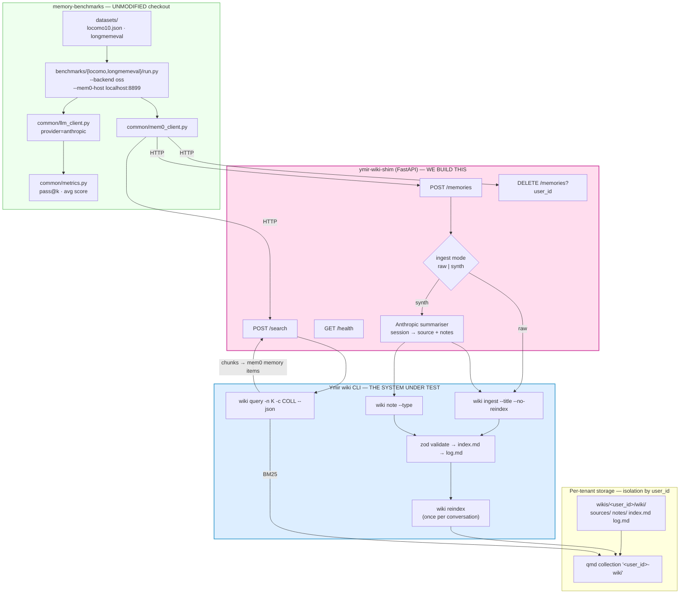

# Benchmarking the Ymir wiki CLI with `mem0ai/memory-benchmarks`

**Branch:** `feat/wiki-benchmark` · **Worktree:** `.worktrees/wiki-benchmark`

## 1. Goal

Measure the Ymir wiki (`plugins/ymir/wiki-cli` + `qmd` BM25) as a **memory system**,
using the mem0 harness **unmodified**, on LoCoMo and LongMemEval, judged by Anthropic.

### What is actually under test

`wiki query` is a one-line shell-out to `qmd search`. So the wiki's retrieval quality
is really **"how well does BM25 rank the wiki's page schema"**. The A/B below is what
makes the number meaningful rather than just a BM25 score.

| Arm | Ingest path | Isolates |
| --- | --- | --- |
| **A — raw** | session transcript written verbatim via `wiki ingest` | pure BM25 + page-schema retrieval |
| **B — synth** | Anthropic summarises the session → `wiki ingest` + `wiki note` | the value added by the wiki's *synthesis discipline* |

**B − A is the headline result**: how much of the wiki's worth is the disciplined
write path versus the storage substrate.

## 2. Architecture — the shim, not a fork

`benchmarks/locomo/run.py` hardcodes `Mem0Client(...)`, so there is no plugin registry.
But in `oss` mode that client is a plain HTTP client pointed at `--mem0-host`, and the
benchmark only ever exercises **three** endpoints. So instead of forking the harness we
reimplement its API surface over the wiki CLI. The harness stays a pristine checkout.



### Contract mapping

| mem0 endpoint | Wiki CLI realisation |
| --- | --- |
| `POST /memories` `{messages, user_id}` | raw: `wiki ingest --title "<conv>-<session>" --no-reindex` (stdin = transcript)<br/>synth: Anthropic → `wiki ingest` + `wiki note --type entity\|concept` |
| `POST /search` `{query, user_id, limit}` | `wiki query "<q>" -n <limit> -c <user_id>-wiki --json` → map each chunk to `{id, memory, score}` |
| `DELETE /memories?user_id=` | `rm -rf wikis/<user_id>` + drop the qmd collection |
| `GET /health` | probe `wiki --version` + `qmd --version` |

## 3. Root-cause fixes to the wiki CLI (not workarounds)

Building the shim surfaced defects in `wiki query` itself. Per project policy these get
fixed at the root rather than bypassed in the adapter — the benchmark must exercise the
**real** code path, and `qmd` must not be called behind the CLI's back.

### 3.1 BUG — `wiki query` is not scoped to its own collection

`src/reindex.ts` indexes the wiki as collection `<parent-basename>-wiki`, but
`src/commands/query.ts` runs:

```ts
return run("qmd", ["search", i.q, "--json", "--files"]);
```

with **no `-c/--collection` flag**. `qmd search` therefore searches *every collection
registered on the machine* — a user's notes, other projects' wikis. This is a real
correctness and information-leak bug in shipped behaviour, independent of benchmarking.
It would also silently destroy tenant isolation across the 10 LoCoMo users.

**Fix:** derive the collection name with the same helper `reindex` uses and pass `-c`.

### 3.2 `wiki query` cannot limit results

No `-n` passthrough. mem0 evaluates at cutoffs `10,20,50,200`; without a limit every
cutoff returns the same set and the cutoff axis is meaningless.

**Fix:** add `--limit <n>`, default to qmd's own default.

### 3.3 `--files` makes top-k incomparable

`--files` returns whole *pages*. A page is not a memory item, so "top-10" means ten
entire documents versus mem0's ten atomic facts — not a like-for-like comparison.

**Fix:** add `--chunks` (drop `--files`) so retrieval is chunk-level; keep `--files` as
the default so existing behaviour is unchanged.

All three are additive and covered by new tests in `plugins/ymir/wiki-cli/test/query.test.ts`.

## 4. Deliverables

```
benchmarks/
├── PLAN.md                     ← this file
├── README.md                   ← how to reproduce a run
├── shim/
│   ├── pyproject.toml
│   ├── app.py                  ← FastAPI, the 4 endpoints
│   ├── wiki_backend.py         ← subprocess driver for the wiki CLI
│   ├── synthesiser.py          ← arm B: Anthropic session → source + notes
│   └── tenancy.py              ← user_id → wiki root + qmd collection
├── scripts/
│   ├── setup.sh                ← install qmd, build wiki CLI, clone harness, fetch datasets
│   ├── run-locomo.sh           ← both arms
│   └── run-longmemeval.sh
└── results/                    ← run outputs + the comparison writeup
```

The harness itself is cloned into `benchmarks/.vendor/memory-benchmarks` and **gitignored** —
we never edit it, so it stays trivially upgradable.

## 5. Phases

| # | Phase | Exit condition |
| --- | --- | --- |
| 1 | **Fix `wiki query`** (§3) + tests | `bun test` green; query scoped, limited, chunkable |
| 2 | **Shim skeleton** — `/health`, `/memories`, `/search`, `DELETE`, arm A only | curl round-trip: ingest 2 messages, search, get chunks back |
| 3 | **Wire the harness** — clone, datasets, Anthropic env, `--backend oss` | `--conversations 1` LoCoMo pilot completes end-to-end |
| 4 | **Pilot + calibrate** — 2 conversations, cutoffs `10,20` | non-zero scores; sanity-read 10 judged answers by hand |
| 5 | **Arm B synthesiser** | same pilot, arm B, scores differ from arm A |
| 6 | **Full runs** — LoCoMo + LongMemEval × {raw, synth} | 4 result sets in `results/` |
| 7 | **Writeup** — A/B delta, failure taxonomy, where BM25 breaks | `results/REPORT.md` |

Phase 4 is a hard gate. We do **not** spend a full run's budget before a hand-read of
judged samples confirms the pipeline is sound.

## 5b. LLM routing — Claude Code headless, no API key

`shim/claude_proxy.py` serves the Anthropic Messages API from `claude -p`. The
harness builds `anthropic.AsyncAnthropic()`, the SDK honours
`ANTHROPIC_BASE_URL`, so every answerer/judge/structured call is rerouted with
the harness still unmodified. The harness's Anthropic path is plain text in,
`content[0].text` out — even "structured output" is just a JSON instruction — so
one text-only endpoint covers everything, including arm B's synthesiser.

Verified end-to-end against a stubbed CLI: the real `anthropic` SDK parses the
proxy's responses into `Message` objects, and the harness's own `LLMClient`
`generate()` and `judge_yes_no()` both work through it.

Two accepted consequences: `temperature` cannot be honoured (the CLI has no such
flag), and throughput is process-bound rather than rate-limit-bound.

## 6. Cost — this is the main risk

Answer + judge fires **once per cutoff per question**:

| Run | Questions | × cutoffs | × (answer+judge) | Calls |
| --- | --- | --- | --- | --- |
| LoCoMo | ~300 | 4 | 2 | ~2,400 |
| LongMemEval | 500 | 4 | 2 | ~4,000 |
| **× 2 arms** | | | | **~12,800** |

Plus ~200–10,000 summarisation calls for arm B. At Sonnet rates with multi-KB retrieved
contexts this is plausibly **$150–250**.

**Mitigations, recommended by default:**
- Cut `--top-k-cutoffs` to `10,20` → halves the bill, and k=50/200 is meaningless for a
  wiki whose pages are large anyway.
- Use Haiku as the **answerer**, Sonnet as the **judge** (judge quality is what matters).
- LongMemEval without `--all-questions` for the first pass.
- Phase 4 pilot before any full run.

## 7. Risks

| Risk | Handling |
| --- | --- |
| **O(n²) ingest** — every `ingest` revalidates the whole wiki, rebuilds `index.md`, and reindexes qmd | `--no-reindex` per call (flag exists), one `wiki reindex` per conversation. If still slow, profile `validateWiki` before optimising |
| **LongMemEval haystack scale** — thousands of sessions per question | Scope to a question subset first; flat `sources/` dir may need sharding |
| **Cross-tenant leakage** | Fixed at root by §3.1; assert in a shim test that user A never retrieves user B's chunk |
| **Unflattering result** | That is a legitimate finding. BM25-over-markdown losing to a fact-extraction memory system is *information*, and the A/B says whether synthesis closes the gap |
| **qmd version drift** | Pin `@tobilu/qmd` in `setup.sh` and record the version in every result set |

## 8. Environment prerequisites

- **`claude login`** — the CLI's stored OAuth session is expired and its
  `refreshToken` is empty, so it cannot self-heal. This is the one remaining
  blocker; `preflight()` probes it before every run.
- `qmd` — installed (`@tobilu/qmd` 2.5.3, at `~/.bun/bin`).
- Python venv — provisioned at `benchmarks/.venv`.
- No API key of any kind is needed: `claude_proxy` covers the LLM side and the
  wiki shim replaces the mem0 OSS server, which was the only component that
  required OpenAI for extraction and embeddings.
