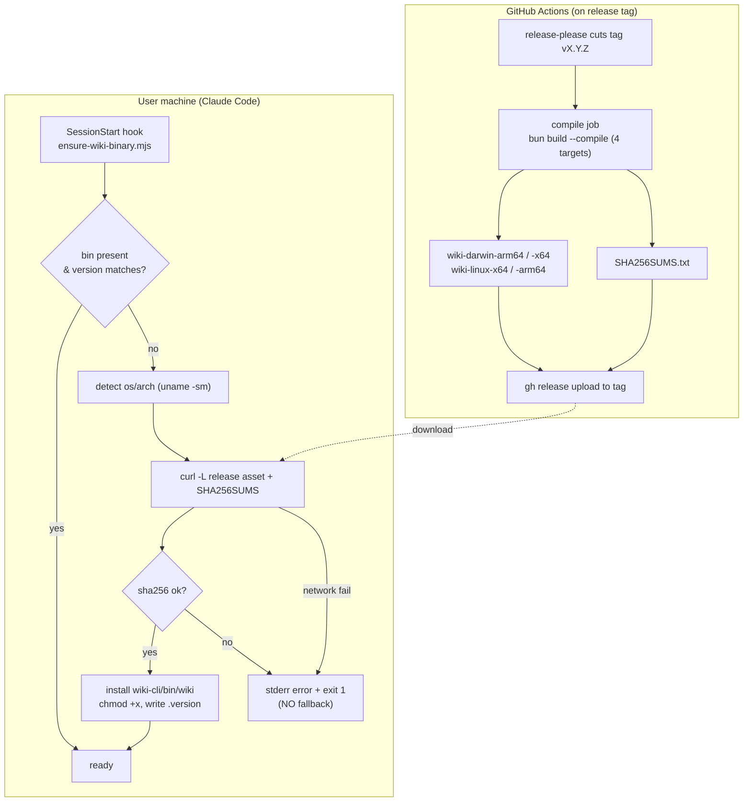
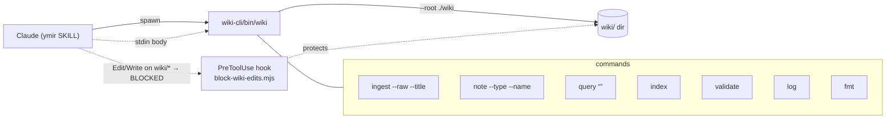

# Wiki CLI: GitHub Release binaries + auto-fetch on plugin use

Date: 2026-06-17
Status: approved (design)
Branch: `feat/wiki-cli-publish`

## Problem

The Ymir wiki CLI (`plugins/ymir/wiki-cli`, `@ymir/wiki-cli`) is run by the
ymir SKILL via `node ${CLAUDE_PLUGIN_ROOT}/wiki-cli/dist/cli.js`. We want users
who install the Claude plugin to get a standalone, ready-to-run binary
automatically, with no manual install step and no Node dependency at runtime.

## Goals

- Compile standalone single-file binaries on each release and publish them as
  GitHub Release assets.
- When the plugin is used, automatically fetch the matching-platform binary
  from the GitHub Release into a cached location.
- The LLM drives the wiki exclusively through this binary.

## Non-goals (YAGNI)

- No Windows target.
- No npm / GitHub Packages publishing.
- No self-update beyond a version-stamp check.
- No code signing beyond sha256 checksums.

## Hard requirement: fail fast, no fallback

There is **no `node dist/cli.js` fallback**. Runtime never touches `dist`.

- If the SessionStart hook cannot download or verify the binary, it writes a
  loud error to stderr and exits non-zero. No silent no-op.
- If the SKILL is asked to run the wiki CLI and the binary is absent, it stops
  with an explicit error ("wiki binary not installed — SessionStart hook
  failed, see log") and does not attempt any other execution path.
- `dist/cli.js` is no longer shipped or committed in the plugin (gitignored).
  The `build` script remains only as input to the `compile` step.

## Platforms / asset naming

Four `bun --compile` targets, asset label per platform:

| bun target          | asset name          | uname -sm        |
|---------------------|---------------------|------------------|
| bun-darwin-arm64    | `wiki-darwin-arm64` | `Darwin arm64`   |
| bun-darwin-x64      | `wiki-darwin-x64`   | `Darwin x86_64`  |
| bun-linux-x64       | `wiki-linux-x64`    | `Linux x86_64`   |
| bun-linux-aarch64   | `wiki-linux-arm64`  | `Linux aarch64` / `Linux arm64` |

Plus `SHA256SUMS.txt` covering all four assets.

## Architecture — publish & auto-fetch

## Architecture — how the LLM uses the CLI

LLM contract: never hand-edit `wiki/`. Pipe content to `wiki ingest` /
`wiki note` via stdin; read back with `wiki query`; keep `index.md` / `log.md`
fresh via `index` / `log`; gate with `validate`. The PreToolUse hook blocks raw
edits to `wiki/` so the CLI is the only writer.

## Components

### 1. `compile` CI job (`.github/workflows/release-please.yml`)
- `needs: release-please`, guarded by
  `if: needs.release-please.outputs.release_created == 'true'`.
- `runs-on: ubuntu-latest`, `working-directory: plugins/ymir/wiki-cli`.
- `oven-sh/setup-bun@v2` (bun 1.3.14), `bun install --frozen-lockfile`.
- Matrix or sequential over 4 targets:
  `bun build ./src/cli.ts --compile --target=<t> --outfile dist/wiki-<label>`.
- `sha256sum dist/wiki-* > dist/SHA256SUMS.txt`.
- `gh release upload <tag> dist/wiki-* dist/SHA256SUMS.txt`
  (`tag` = `needs.release-please.outputs.tag_name`,
  `GH_TOKEN: ${{ secrets.GITHUB_TOKEN }}`).

### 2. Target-detection module (`src/platform.ts`)
- Pure function `assetLabel(unameS: string, unameM: string): string` mapping to
  one of the four labels; throws on unsupported platform with a clear message.
- Unit-tested. Imported by the hook so logic is testable without network.

### 3. SessionStart hook (`templates/hooks/ensure-wiki-binary.mjs`)
- Resolve `${CLAUDE_PLUGIN_ROOT}`; target dir `wiki-cli/bin/`.
- Read expected version from `.claude-plugin/plugin.json` `$.version` — this is
  the field release-please keeps in sync with the release tag. Do NOT use
  `wiki-cli/package.json` (independent, drifts).
- If `bin/wiki` exists and `bin/.version` == expected → exit 0.
- Else detect platform via `uname -sm`, build asset URL:
  `https://github.com/<owner>/<repo>/releases/download/v<version>/wiki-<label>`.
- `curl -fL` asset + `SHA256SUMS.txt`; verify sha256 of the downloaded asset
  against the sums file. On mismatch or any curl failure → `console.error` a
  loud message and `process.exit(1)`.
- On success: write to `bin/wiki`, `chmod 0o755`, write `bin/.version`.
- Wire into the hooks the SKILL installs (extend
  `templates/hooks/settings.snippet.json` with a `SessionStart` entry).

### 4. SKILL / plugin wiring (`plugins/ymir/SKILL.md`)
- Replace `node ${CLAUDE_PLUGIN_ROOT}/wiki-cli/dist/cli.js` with
  `${CLAUDE_PLUGIN_ROOT}/wiki-cli/bin/wiki`.
- Document: if the binary is missing, stop and report the SessionStart failure;
  do not run any fallback.

### 5. Packaging cleanup (`plugins/ymir/wiki-cli`)
- Add `"compile"` script to `package.json`.
- `.gitignore` `dist/`; remove tracked `dist/cli.js`.

## Data flow

1. Release tag → CI compiles 4 binaries + sums → assets on the Release.
2. First Claude session after install → SessionStart hook detects platform,
   downloads + verifies the matching binary into `wiki-cli/bin/wiki`, stamps
   version. Subsequent sessions: stamp matches → no-op.
3. SKILL runs `wiki-cli/bin/wiki --root ./wiki <cmd>` for all wiki operations.

## Error handling

| Failure | Behavior |
|---------|----------|
| Unsupported platform | hook: `assetLabel` throws clear msg → exit 1 |
| Download fails (network/404) | hook: stderr error → exit 1 |
| sha256 mismatch | hook: stderr error, do not install → exit 1 |
| Binary missing at SKILL run | SKILL stops, reports hook failure, no fallback |

## Testing

- `src/platform.ts`: unit tests for all four mappings + unsupported-platform
  throw (`bun test`).
- `compile` CI job is the integration check (all 4 targets build).
- Manual: run a compiled binary `./dist/wiki-<label> --root ./wiki validate`
  → prints `wiki valid`.

## Version source

- Single source of truth = `plugins/ymir/.claude-plugin/plugin.json` `$.version`,
  which release-please updates (via `extra-files`) to match each release tag.
- Asset URL tag = `v<that version>`. Hook stamp compares against the same value.
- `wiki-cli/package.json` version is independent and MUST NOT be used for the
  tag or stamp.

## Open dependencies

- `<owner>/<repo>` = `muitneliss/ymir`.
- release-please: root package `.`, `release-type: simple`, `package-name: ymir`.
  Tag format = `v<version>` (single root package, no component prefix). Confirm
  on first release; the `compile` job reads `needs.release-please.outputs.tag_name`
  rather than constructing it.

## Pre-existing issue (out of scope, flagged)

`.release-please-manifest.json` and `version.txt` are at `0.1.0` while
`plugin.json` and `wiki-cli/package.json` are at `0.2.0`. This drift predates
this work. It affects what the next release tag will be (computed from `0.1.0`).
Not fixed here — flagged for the user to decide.
